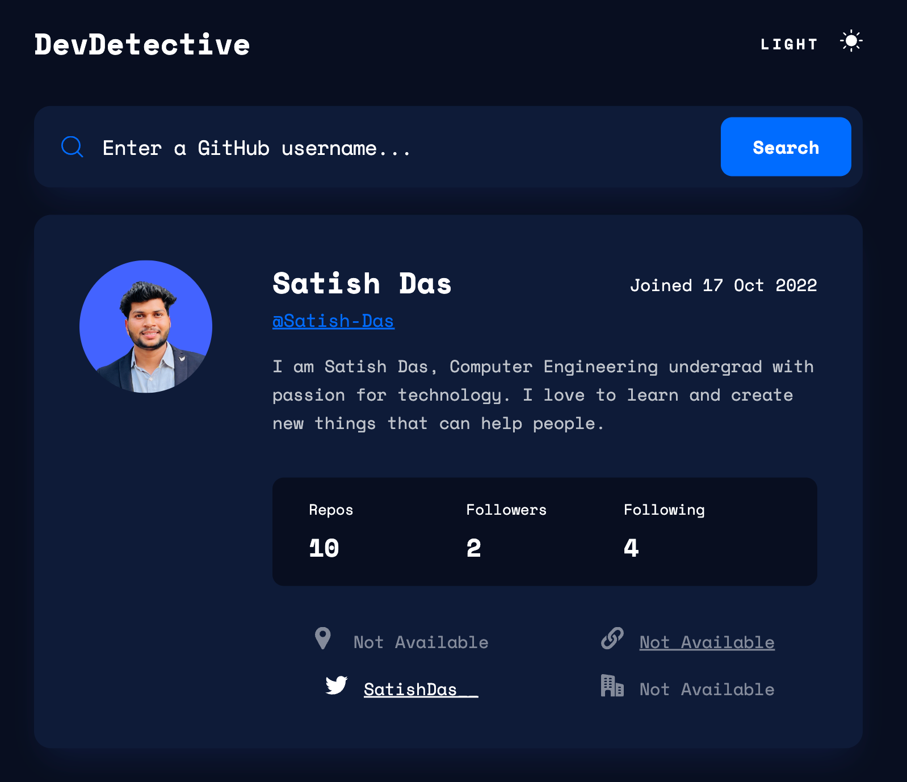
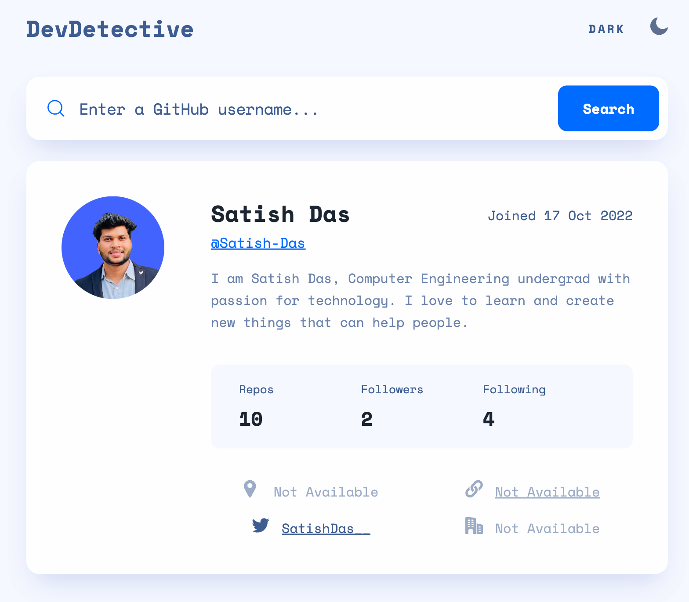
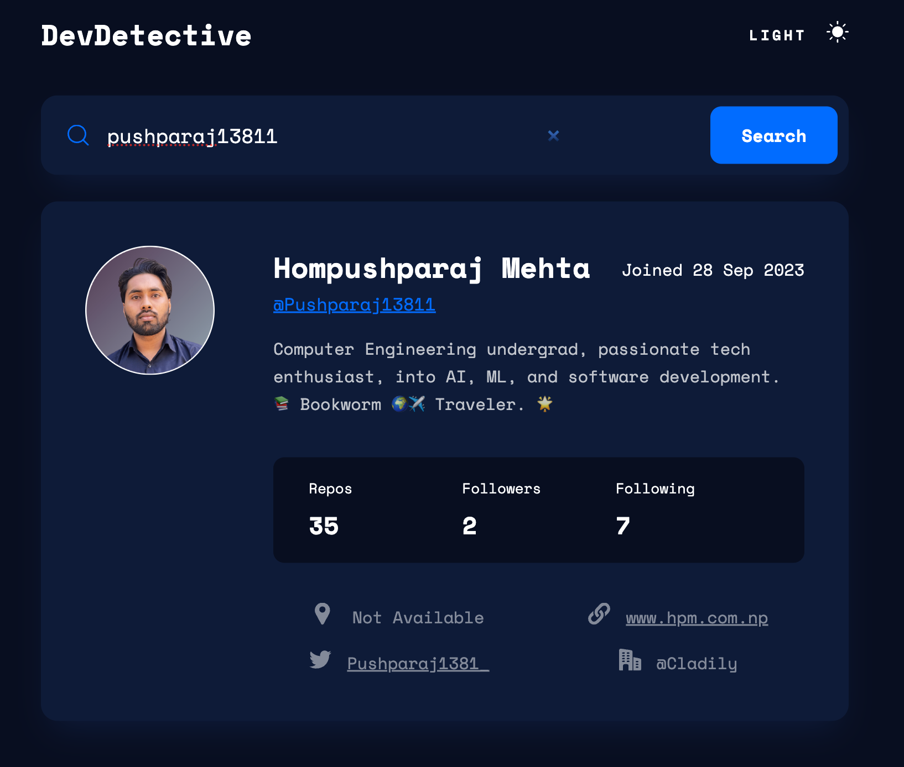

# Developer Detective  

DevDetective is a GitHub user profile viewer application that allows users to search for GitHub profiles and view detailed information about users, including repositories, followers, and more.  

---

## Features  

- Search for any GitHub user by their username.  
- Display detailed profile information, including:  
  - Name, username, and join date.  
  - Total repositories, followers, and following count.  
  - User bio/description.  
  - Links to external profiles or websites, if available.  
- Light and Dark Mode toggle for improved user experience and accessibility.  

---

## Tools and Technologies  

- **HTML, CSS, JavaScript**: Used for creating the structure, design, and interactive behavior of the application.  
- **React.js**: Used for building a dynamic and responsive user interface.  
- **GitHub API**: Integrated to fetch and display real-time data of GitHub users.  

---

## How to Run  

1. Clone this repository:  
   ```bash  
   git clone https://github.com/your-repo-link.git  


** Screenshots **

*Dark Mode*


*Light Mode*


*Search Results*
